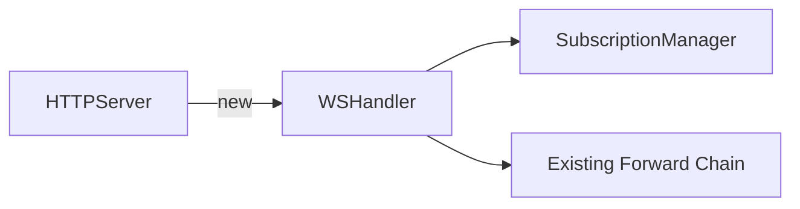

# xray

Deterministic architecture diffs for pull requests.

See the bones of a change without reading 3,600 lines.

## What it does

xray posts a structured comment on every PR showing **what architecturally changed** — not opinions, not scores, just facts a reviewer needs before diving into code.

**Extract deterministically, render with AI.** The facts come from git and grep (trustworthy). The AI only turns structured data into a readable diagram.

### Output

A single PR comment with three sections:

**1. Change classification** — how much is real logic vs tests vs boilerplate

```
Logic:        847 lines  (23%) ████░░░░░░
Tests:        714 lines  (19%) ███░░░░░░░
Types/Config: 312 lines   (8%) █░░░░░░░░░
Docs/Other:  1740 lines  (50%) █████████░
```

**2. Structural changes** — new symbols introduced, removed, or modified

```
+ SubscriptionManager        (new interface)
+ WsJsonRpcClient            (new struct)
+ ErrSubscriptionNotFound    (new error)
+ WebSocketServerConfig      (new config struct)
~ ServeHTTP                  (modified)
- OldHandler                 (removed)
```

**3. Dependency diagram** — Mermaid diagram showing how new code connects to existing code



### What it does NOT do

- No code quality opinions
- No "this looks risky" judgments
- No line-by-line review comments
- No suggested fixes
- No scores or grades

## Quick start

```yaml
name: xray
on:
  pull_request:
    types: [opened, synchronize, ready_for_review]

permissions:
  contents: read
  pull-requests: write

jobs:
  xray:
    if: github.event.pull_request.draft == false
    runs-on: ubuntu-latest
    steps:
      - uses: kasrakhosravi/xray@v1
        with:
          github_token: ${{ secrets.GITHUB_TOKEN }}
          anthropic_api_key: ${{ secrets.ANTHROPIC_API_KEY }}
```

No config files. No document IDs. No accounts. Works on any repo.

## Inputs

| Input | Required | Default | Description |
|-------|----------|---------|-------------|
| `github_token` | Yes | — | GitHub token for posting PR comments |
| `anthropic_api_key` | Yes | — | For diagram generation only |
| `base_ref` | No | PR base | Branch to diff against |
| `languages` | No | `auto` | Comma-separated list, or `auto` to detect |
| `diagram` | No | `true` | Set `false` to skip AI diagram (deterministic sections only) |
| `min_lines` | No | `50` | Skip PRs smaller than this |

## Language support

xray is language-agnostic by default. Change classification works for any language (git diff based).

Symbol-level extraction (new types, functions, errors) uses regex patterns per language. Ships with:

- Go
- TypeScript
- Python
- Rust
- Java

If a language has no pattern file, xray still works — it shows the change classification and file list without symbol extraction. Add your own patterns by contributing a JSON file to `src/patterns/`.

## How it works

1. `git diff` → raw diff, stats, changed files
2. Detect languages from file extensions
3. Grep the diff for new types, functions, errors using language-specific patterns
4. Classify every changed line as logic / test / types / docs
5. Send structured extraction (not raw diff) to Claude for Mermaid diagram
6. Post sticky PR comment that updates on each push

The AI never sees your full codebase. It receives a structured list of symbols and their relationships, and outputs a Mermaid diagram. That's it.

## `diagram: false` mode

Don't want AI? Set `diagram: false` and xray posts only the deterministic sections (change classification + structural changes). Zero API calls, zero cost.

## License

MIT
