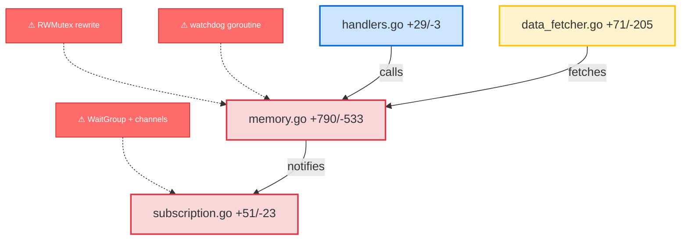

# xray

[](https://github.com/marketplace/actions/xray)
[](https://opensource.org/licenses/MIT)
[](https://github.com/kasrakhosravi/xray/releases)

The bottleneck of software isn't writing code anymore — it's reviewing it. AI generates 3,600-line PRs in minutes, but a human still needs hours to understand what changed, where the risk is, and what to focus on.

xray fixes this. It extracts facts from the diff deterministically (git + regex), then renders them as a risk-colored architecture diagram. No opinions, no scores — just a visual map of what changed and what needs attention.

## Output

Every PR gets a comment like this:

---

**Rewrites memory store locking and adds block/receipt validation directives**



| | File | Lines | Key changes | Risk |
|:---:|:---|:---:|:---|:---|
| 🔴 | memory.go | `+790/-533` | `readIngestionState`, `watchdog`, ... | ⚠ RWMutex, +5 primitives |
| 🔴 | subscription.go | `+51/-23` | — | ⚠ WaitGroup, channels |
| 🟠 | data_fetcher.go | `+71/-205` | `errorToLabel`, `enrichReceipts` | ⚠ error path changes |
| 🔵 | handlers.go | `+29/-3` | — | |
| | _6 test files_ | `+762` | | |

🔴 concurrency (review first) · 🟠 error paths · 🔵 modified

---

## Usage

### Anthropic

```yaml
name: xray
on:
  pull_request:
    types: [opened, synchronize, ready_for_review]
  issue_comment:
    types: [created]

permissions:
  contents: read
  pull-requests: write

jobs:
  xray-on-pr:
    if: github.event_name == 'pull_request' && github.event.pull_request.draft == false
    runs-on: ubuntu-latest
    steps:
      - uses: actions/checkout@v4
        with:
          fetch-depth: 0
      - uses: kasrakhosravi/xray@v0
        with:
          github_token: ${{ secrets.GITHUB_TOKEN }}
          anthropic_api_key: ${{ secrets.ANTHROPIC_API_KEY }}

  xray-on-command:
    if: |
      github.event_name == 'issue_comment' &&
      github.event.issue.pull_request &&
      contains(fromJSON('["OWNER", "MEMBER"]'), github.event.comment.author_association) &&
      contains(github.event.comment.body, '/xray')
    runs-on: ubuntu-latest
    steps:
      - uses: actions/checkout@v4
        with:
          ref: refs/pull/${{ github.event.issue.number }}/head
          fetch-depth: 0
      - uses: kasrakhosravi/xray@v0
        with:
          github_token: ${{ secrets.GITHUB_TOKEN }}
          anthropic_api_key: ${{ secrets.ANTHROPIC_API_KEY }}
```

### OpenAI

```yaml
- uses: kasrakhosravi/xray@v0
  with:
    github_token: ${{ secrets.GITHUB_TOKEN }}
    openai_api_key: ${{ secrets.OPENAI_API_KEY }}
```

### OpenRouter

```yaml
- uses: kasrakhosravi/xray@v0
  with:
    github_token: ${{ secrets.GITHUB_TOKEN }}
    openrouter_api_key: ${{ secrets.OPENROUTER_API_KEY }}
```

### Custom model

```yaml
- uses: kasrakhosravi/xray@v0
  with:
    github_token: ${{ secrets.GITHUB_TOKEN }}
    openai_api_key: ${{ secrets.OPENAI_API_KEY }}
    model: gpt-4-turbo
```

### Deterministic only (no AI, $0)

```yaml
- uses: kasrakhosravi/xray@v0
  with:
    github_token: ${{ secrets.GITHUB_TOKEN }}
    diagram: "false"
```

## Inputs

| Input | Required | Description |
|-------|----------|-------------|
| `github_token` | Yes | GitHub token |
| `anthropic_api_key` | No | Anthropic API key |
| `openai_api_key` | No | OpenAI API key |
| `openrouter_api_key` | No | OpenRouter API key |
| `model` | No | Model override |
| `diagram` | No | `false` to skip AI diagram |
| `min_lines` | No | Skip small PRs (default: 50) |
| `languages` | No | `auto` or comma-separated |
| `base_ref` | No | Branch to diff against |

## Languages

Go · TypeScript · Python · Rust · Java · Solidity · C# · Ruby · Swift · Kotlin · PHP

Adding a language = one JSON file in `src/patterns/`.

## License

MIT
